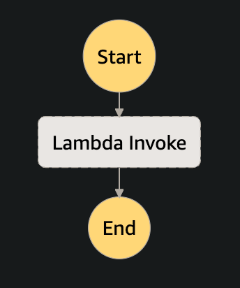

# TestLambdaParameterFromSfn

StepFunctions から　 Lambda 　への変数を渡す動作確認です。

1. Lambda を作成する

2. Lambda を呼び出す下記の　 StepFunctions を作成する

   

   StepFunctions の定義では、Lambda に渡す変数を下記のように、Parameters の Payload に渡す

   ```json
    "Parameters": {
       "Payload": {
         "InvokeNumber": "1"
       }
   ```

3. Lambda 関数を作成し、ビルド・デプロイする

   ```sh
   make
   ```

# 参考資料

https://qiita.com/yukpiz/items/269277a97053237a6980
